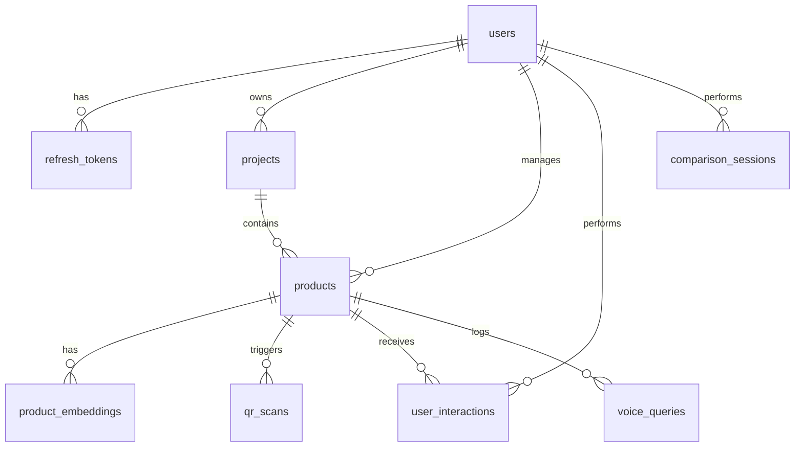

# Database Schema Documentation (Postgres + Supabase)
## Project Name: ScanVista

This document outlines the relational database architecture for **ScanVista**. The system is built on PostgreSQL, utilizing standard relational integrity constraints, indexes for query performance, JSONB for flexible nested data, and the `pgvector` extension to power AI-driven product recommendations.

---

## 1. Entity-Relationship Diagram (ERD)



---

## 2. Table Specifications

### 2.1 Users Table (`users`)
Stores user profiles, credentials, and configuration preferences.
*   **Table Name**: `users`
*   **SQL Definition**: [users](file:///c:/Users/hp/Desktop/scanvista/schema.sql#L2-L10)

| Column | Data Type | Constraints | Description |
| :--- | :--- | :--- | :--- |
| `id` | UUID | PRIMARY KEY, DEFAULT `gen_random_uuid()` | Unique user identifier. |
| `name` | VARCHAR(100) | NOT NULL | User's full name. |
| `email` | VARCHAR(255) | UNIQUE, NOT NULL | Hashed login email. |
| `password_hash` | VARCHAR(255) | NOT NULL | Securely hashed password (bcrypt). |
| `preferred_language`| VARCHAR(10) | DEFAULT `'en'` | Standard language code (e.g. `'en'`, `'es'`). |
| `created_at` | TIMESTAMPTZ | DEFAULT `NOW()` | Timestamp when user registered. |
| `updated_at` | TIMESTAMPTZ | DEFAULT `NOW()` | Last profile modification timestamp. |

---

### 2.2 Refresh Tokens Table (`refresh_tokens`)
Manages active JWT refresh cycles to maintain safe, persistent sessions.
*   **Table Name**: `refresh_tokens`
*   **SQL Definition**: [refresh_tokens](file:///c:/Users/hp/Desktop/scanvista/schema.sql#L13-L19)

| Column | Data Type | Constraints | Description |
| :--- | :--- | :--- | :--- |
| `id` | UUID | PRIMARY KEY, DEFAULT `gen_random_uuid()` | Unique identifier. |
| `user_id` | UUID | FOREIGN KEY REFERENCES `users(id)` ON DELETE CASCADE | Owner of the refresh token. |
| `token_hash` | VARCHAR(255) | NOT NULL | SHA256 hashed refresh token. |
| `expires_at` | TIMESTAMPTZ | NOT NULL | Expiration timestamp. |
| `created_at` | TIMESTAMPTZ | DEFAULT `NOW()` | Token issuance timestamp. |

---

### 2.3 Projects Table (`projects`)
Provides logical workspace division grouping different product arrays together.
*   **Table Name**: `projects`
*   **SQL Definition**: [projects](file:///c:/Users/hp/Desktop/scanvista/schema.sql#L22-L29)

| Column | Data Type | Constraints | Description |
| :--- | :--- | :--- | :--- |
| `id` | UUID | PRIMARY KEY, DEFAULT `gen_random_uuid()` | Unique project identifier. |
| `user_id` | UUID | FOREIGN KEY REFERENCES `users(id)` ON DELETE CASCADE | Project owner/creator. |
| `name` | VARCHAR(150) | NOT NULL | Workspace or Campaign name. |
| `description` | TEXT | NULL | Detailed project narrative. |
| `created_at` | TIMESTAMPTZ | DEFAULT `NOW()` | Creation timestamp. |
| `updated_at` | TIMESTAMPTZ | DEFAULT `NOW()` | Modification timestamp. |

---

### 2.4 Products Table (`products`)
Stores complete details about scanned products, WebGL assets, pricing, and AI metadata.
*   **Table Name**: `products`
*   **SQL Definition**: [products](file:///c:/Users/hp/Desktop/scanvista/schema.sql#L32-L72)

| Column | Data Type | Constraints | Description |
| :--- | :--- | :--- | :--- |
| `id` | UUID | PRIMARY KEY, DEFAULT `gen_random_uuid()` | Unique product identifier. |
| `project_id` | UUID | FOREIGN KEY REFERENCES `projects(id)` ON DELETE CASCADE | Associated workspace campaign. |
| `user_id` | UUID | FOREIGN KEY REFERENCES `users(id)` ON DELETE CASCADE | Owner who registered this product. |
| `name` | VARCHAR(200) | NOT NULL | Public product display name. |
| `tagline` | VARCHAR(300) | NULL | Short marketing catchphrase. |
| `description` | TEXT | NULL | Detailed narrative description. |
| `category` | VARCHAR(100) | NULL | Product category (e.g. `'Electronics'`). |
| `brand` | VARCHAR(100) | NULL | Manufacturer or brand. |
| `sku` | VARCHAR(100) | NULL | Stock Keeping Unit. |
| `thumbnail_url` | TEXT | NULL | Card thumbnail image. |
| `model_url` | TEXT | NULL | Supabase Storage path to the `.glb`/`.gltf` 3D model. |
| `model_generated` | BOOLEAN | DEFAULT `FALSE` | Flag indicating if model is AI-generated fallback. |
| `gallery_urls` | JSONB | DEFAULT `'[]'` | Array of additional media strings. |
| `features` | JSONB | DEFAULT `'[]'` | List of core benefits (e.g. `["Waterproof"]`). |
| `specs` | JSONB | DEFAULT `'[]'` | Nested list of key-value properties. |
| `price` | NUMERIC(12,2) | NULL | Purchase pricing. |
| `currency` | VARCHAR(10) | DEFAULT `'USD'` | Transaction currency code. |
| `buy_url` | TEXT | NULL | URL redirection for commerce checkouts. |
| `qr_label` | VARCHAR(100) | NULL | Descriptive custom text on QR. |
| `ai_summary` | TEXT | NULL | Short summarization for TTS. |
| `ai_use_cases` | JSONB | DEFAULT `'[]'` | Struct list of usage templates. |
| `ai_comparisons`| JSONB | DEFAULT `'[]'` | Competitor comparative metrics. |
| `is_published` | BOOLEAN | DEFAULT `TRUE` | Public visibility state. |
| `created_at` | TIMESTAMPTZ | DEFAULT `NOW()` | Creation timestamp. |
| `updated_at` | TIMESTAMPTZ | DEFAULT `NOW()` | Modification timestamp. |

#### JSONB Structures Specs
*   **`specs` Scheme Example**:
    ```json
    [
      { "key": "Weight", "value": "180g" },
      { "key": "Dimensions", "value": "150 x 75 x 8 mm" }
    ]
    ```
*   **`features` Scheme Example**:
    ```json
    [
      "Corrosion-resistant casing",
      "IP68 Waterproof rating",
      "Bluetooth 5.3 instant syncing"
    ]
    ```

---

### 2.5 Product Embeddings Table (`product_embeddings`)
Supports similarity lookups for the recommendation module. Requires `pgvector` database extension.
*   **Table Name**: `product_embeddings`
*   **SQL Definition**: [product_embeddings](file:///c:/Users/hp/Desktop/scanvista/schema.sql#L75-L80)

| Column | Data Type | Constraints | Description |
| :--- | :--- | :--- | :--- |
| `id` | UUID | PRIMARY KEY, DEFAULT `gen_random_uuid()` | Unique identifier. |
| `product_id` | UUID | FOREIGN KEY REFERENCES `products(id)` ON DELETE CASCADE | Associated product. |
| `embedding` | VECTOR(1536) | | Open-AI Ada-002 semantic vector representation (1536 dimensions). |
| `model_version` | VARCHAR(50) | | Vectorizer version reference (e.g. `'text-embedding-ada-002'`). |
| `created_at` | TIMESTAMPTZ | DEFAULT `NOW()` | Embedding calculation date. |

---

### 2.6 QR Scans Table (`qr_scans`)
Analytics tracker logging scanning engagement metrics.
*   **Table Name**: `qr_scans`
*   **SQL Definition**: [qr_scans](file:///c:/Users/hp/Desktop/scanvista/schema.sql#L83-L96)

| Column | Data Type | Constraints | Description |
| :--- | :--- | :--- | :--- |
| `id` | UUID | PRIMARY KEY, DEFAULT `gen_random_uuid()` | Scan event record identifier. |
| `product_id` | UUID | FOREIGN KEY REFERENCES `products(id)` ON DELETE CASCADE | Target product scanned. |
| `scanned_at` | TIMESTAMPTZ | DEFAULT `NOW()` | Event timestamp. |
| `device_type` | VARCHAR(20) | NULL | Scanner device category: `mobile`, `tablet`, `desktop`. |
| `device_os` | VARCHAR(50) | NULL | Operating system details (e.g. `iOS`, `Android`). |
| `browser` | VARCHAR(50) | NULL | Browser signature (e.g. `Safari`, `Chrome`). |
| `country_code` | VARCHAR(5) | NULL | Country geolocation code. |
| `ip_hash` | VARCHAR(64) | NULL | SHA256 anonymized representation of visitor IP. |
| `session_duration_seconds` | INTEGER | NULL | Total user session duration. |
| `ar_used` | BOOLEAN | DEFAULT `FALSE` | Did the user activate WebXR AR projection? |
| `voice_used` | BOOLEAN | DEFAULT `FALSE` | Did the user interact with the voice assistant? |

---

### 2.7 User Interaction History Table (`user_interactions`)
Tracks actions taken by registered users to personalize recommendations over time.
*   **Table Name**: `user_interactions`
*   **SQL Definition**: [user_interactions](file:///c:/Users/hp/Desktop/scanvista/schema.sql#L99-L106)

| Column | Data Type | Constraints | Description |
| :--- | :--- | :--- | :--- |
| `id` | UUID | PRIMARY KEY, DEFAULT `gen_random_uuid()` | Unique log identifier. |
| `user_id` | UUID | FOREIGN KEY REFERENCES `users(id)` ON DELETE CASCADE | Associated registered user. |
| `product_id` | UUID | FOREIGN KEY REFERENCES `products(id)` ON DELETE CASCADE | Interacted product. |
| `interaction_type` | VARCHAR(50) | | Action category: `'viewed'`, `'ar_used'`, `'voice_query'`, `'compared'`. |
| `metadata` | JSONB | DEFAULT `'{}'` | Context metadata (e.g., screen orientation). |
| `created_at` | TIMESTAMPTZ | DEFAULT `NOW()` | Log creation date. |

---

### 2.8 Voice Queries Table (`voice_queries`)
Captures transcripts from AI assistant Q&A sessions to audit voice query success.
*   **Table Name**: `voice_queries`
*   **SQL Definition**: [voice_queries](file:///c:/Users/hp/Desktop/scanvista/schema.sql#L109-L117)

| Column | Data Type | Constraints | Description |
| :--- | :--- | :--- | :--- |
| `id` | UUID | PRIMARY KEY, DEFAULT `gen_random_uuid()` | Session transaction log identifier. |
| `product_id` | UUID | FOREIGN KEY REFERENCES `products(id)` ON DELETE CASCADE | Product being queried. |
| `session_id` | VARCHAR(100) | NULL | Browser session correlation key. |
| `query_text` | TEXT | NULL | Input spoken transcript. |
| `response_text` | TEXT | NULL | Output answer generated by AI engines. |
| `language` | VARCHAR(10) | NULL | Locale used during the query (e.g. `'en-US'`). |
| `created_at` | TIMESTAMPTZ | DEFAULT `NOW()` | Event timestamp. |

---

### 2.9 Comparison Sessions Table (`comparison_sessions`)
Maintains logs of user comparison deck states.
*   **Table Name**: `comparison_sessions`
*   **SQL Definition**: [comparison_sessions](file:///c:/Users/hp/Desktop/scanvista/schema.sql#L120-L125)

| Column | Data Type | Constraints | Description |
| :--- | :--- | :--- | :--- |
| `id` | UUID | PRIMARY KEY, DEFAULT `gen_random_uuid()` | Comparison log identifier. |
| `user_id` | UUID | FOREIGN KEY REFERENCES `users(id)` ON DELETE SET NULL | Performing user account (if signed in). |
| `product_ids` | JSONB | NOT NULL | Array of compared product UUIDs (e.g. `["uuid-1", "uuid-2"]`). |
| `created_at` | TIMESTAMPTZ | DEFAULT `NOW()` | Log creation date. |

---

## 3. Database Indexes

To maintain performance levels under heavy analytical and user workloads, several high-impact indexes have been created:

*   **`idx_products_project_id`** (on `products(project_id)`): Speeds up rendering product tables inside workspaces.
*   **`idx_products_user_id`** (on `products(user_id)`): Rapidly matches products owned by specific users.
*   **`idx_products_category`** (on `products(category)`): Supports filter metrics on search displays.
*   **`idx_qr_scans_product_id`** (on `qr_scans(product_id)`): Accelerates dashboard analytic flush operations and aggregations.
*   **`idx_qr_scans_scanned_at`** (on `qr_scans(scanned_at)`): Supports rapid time-series scan rate charting.
*   **`idx_user_interactions_user_id`** (on `user_interactions(user_id)`): Swift lookup for user behavioral profiling.
*   **`idx_user_interactions_product_id`** (on `user_interactions(product_id)`): Optimizes tracking product popularity parameters.