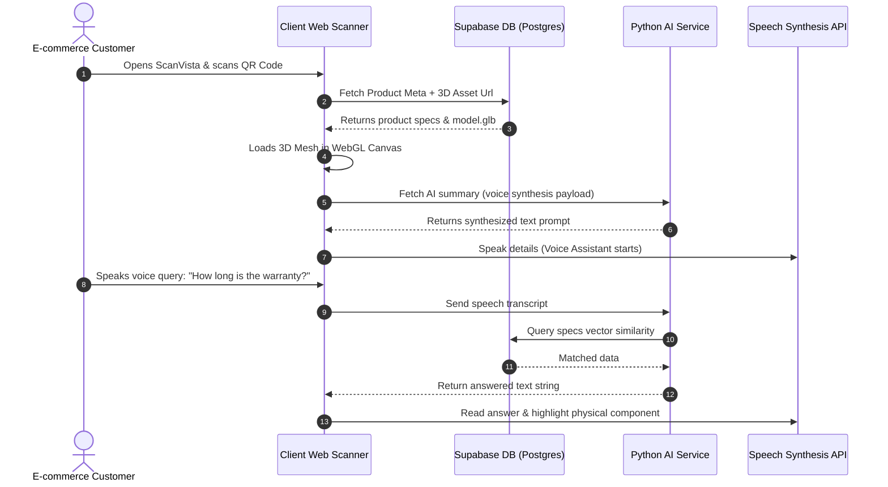

# Product Requirement Document (PRD)
## Project Name: ScanVista — AI-Powered QR to 3D Product Visualizer

> [!NOTE]
> ScanVista transforms static QR codes into immersive, interactive, and educational 3D experiences. By scanning a QR code, users can view a responsive 3D model, interact with it in AR, and receive real-time explanations from an AI voice assistant.

---

## 1. Executive Summary & Overview
ScanVista is an intelligent web application that bridges the gap between physical products and digital engagement. Users scan a QR code using their device's camera, instantly opening an interactive 3D visualization canvas accompanied by a responsive AI voice assistant.

The assistant guides the user through:
*   **Product Benefits & Key Features**: Bulleted, categorized product metrics.
*   **Usage Instructions**: Interactive voice-guided walkthroughs.
*   **Component Explanations**: Exploded and highlighted 3D views.
*   **Comparisons & Context-Aware Recommendations**: Smart suggestions based on similar items.

---

## 2. Problem Statement
Traditional QR codes on product packaging or marketing materials suffer from significant limitations:
*   **Low Engagement**: They typically redirect users to generic, static websites or PDF manuals.
*   **Cognitive Overload**: Text-heavy descriptions are tedious to read on mobile screens.
*   **No Spatial Understanding**: Customers cannot easily visualize the internal mechanics, size, scale, or appearance of the product.
*   **Passive Interaction**: There is no personalized guidance, interactive Q&A, or real-time support.

---

## 3. The ScanVista Solution
ScanVista replaces the passive QR experience with an active, immersive 3D AI agent playground:
1.  **Instant Camera Scan**: Immediate QR detection and fast URL parsing.
2.  **Interactive 3D Engine**: WebGL-based rotatable, zoomable, and explodable 3D assets.
3.  **Real-Time AI Voice Assistant**: Natural, multi-language Speech-to-Text (STT) and Text-to-Speech (TTS) interactions for dynamic Q&A.
4.  **Spatial AR Placement**: Place components directly onto physical surfaces in the real world.
5.  **Analytics & Insights**: Enable businesses to capture user interactions, scans, session durations, and voice queries.

---

## 4. Database & Architectural Alignment (schema.sql Mapping)

To support this product vision, the underlying relational database has been architected to map directly to core PRD features.

| Feature Area | Description | Target Database Table | Key Attributes / Indexes |
| :--- | :--- | :--- | :--- |
| **Authentication & Profile** | Standard JWT authentication, session refreshes, and preferred locale settings. | [`users`](file:///c:/Users/hp/Desktop/scanvista/schema.sql#L2), [`refresh_tokens`](file:///c:/Users/hp/Desktop/scanvista/schema.sql#L13) | `preferred_language`, `token_hash` |
| **Multi-Tenancy / Workspaces** | Group products under specific marketing campaigns or client projects. | [`projects`](file:///c:/Users/hp/Desktop/scanvista/schema.sql#L21) | `user_id` (foreign key) |
| **Core Product Visualizer** | Stores 3D assets, images, features, price, and publication state. | [`products`](file:///c:/Users/hp/Desktop/scanvista/schema.sql#L31) | `model_url`, `features` (JSONB), `specs` (JSONB), `model_generated` (boolean flag) |
| **AI Recommendation Engine** | Vector embedding database for similarity indexing and recommendations. | [`product_embeddings`](file:///c:/Users/hp/Desktop/scanvista/schema.sql#L74) | `embedding` (VECTOR 1536), `idx_products_category` |
| **Analytics Dashboard** | Tracks scanners, device specifications, AR usage, and scan locations. | [`qr_scans`](file:///c:/Users/hp/Desktop/scanvista/schema.sql#L82) | `device_type`, `session_duration_seconds`, `ar_used`, `voice_used` |
| **User Personalization** | Stores historical interactions to refine similarity recommendations. | [`user_interactions`](file:///c:/Users/hp/Desktop/scanvista/schema.sql#L98) | `interaction_type`, `idx_user_interactions_user_id` |
| **Interactive Voice Q&A** | Logs transcriptions and AI responses to audit voice prompt quality. | [`voice_queries`](file:///c:/Users/hp/Desktop/scanvista/schema.sql#L108) | `query_text`, `response_text`, `session_id` |
| **Comparison Deck** | Holds comparison sessions between multiple products. | [`comparison_sessions`](file:///c:/Users/hp/Desktop/scanvista/schema.sql#L119) | `product_ids` (JSONB array) |

---

## 5. Core Feature Specifications

### 5.1 Real-Time QR Scanner
*   **Scanning Mechanism**: Camera-based WebRTC streaming utilizing high-speed canvas capture.
*   **File Upload Support**: Drag-and-drop or select an image to decode static QR codes instantly.
*   **Metadata Extraction**: Decodes QR payloads and routes them to public product pages in less than 2 seconds.

### 5.2 Responsive 3D Visualization Engine
*   **Interactive WebGL Render**: Powered by Three.js, React Three Fiber, and Drei. Supports responsive orbit controls (Pan, Zoom, Rotate).
*   **Exploded View (Phase 2)**: Animates physical components outward to reveal inner structures (e.g., engines, assemblies).
*   **Component Highlighting (Phase 2)**: Visually glows or colors specific components when referenced by the AI voice assistant.

### 5.3 AI Voice Assistant (TTS & STT)
*   **Voice Narrator**: Explains key features using high-quality Text-to-Speech (TTS).
*   **Interactive Q&A**: Speech-to-Text (STT) allows the user to press a voice button and ask queries such as:
    *   *"What material is this casing made of?"*
    *   *"Show me where the battery compartment is."*
*   **Dynamic Response Engine**: FastAPI processes natural language using OpenAI (or free alternatives on Hugging Face), extracting structured specifications from `products.specs` and `products.features`.

### 5.4 Advanced AR Surface Placement
*   **WebXR Session**: Directly integrates WebXR capabilities via `useARSession.js`.
*   **Hit-Test Surface Detection**: Analyzes real-world camera depth streams to place 3D product visualizers onto floor or table surfaces, complete with realistic shadows and scaling.

### 5.5 Multi-Product Comparison Deck
*   **Side-by-Side Panel**: Renders visual and technical comparisons.
*   **Metric Comparison**: Checks technical benchmarks (price, weights, material specifications) pulling from the JSONB arrays in `products.specs`.

---

## 6. Advanced Stand-Out Features

### 6.1 AI-Generated 3D Fallback Models
*   **Mesh Generation**: If a physical product lacks an official `.glb` mesh in `products.model_url`, the backend flags `model_generated = TRUE` and requests the Python FastAPI `ai-service` to approximate a 3D model using generative AI frameworks (e.g., Shap-E / Point-E) from gallery images.

### 6.2 Vector Similarity Recommendation Engine
*   **Semantic Matching**: Employs `pgvector` embeddings in table `product_embeddings` to run semantic queries, finding similar items in the catalog based on raw feature descriptions, category tags, and historical interests.

---

## 7. Typical User Flow

---

## 8. Non-Functional & UI/UX Requirements
*   **Futuristic Glassmorphic Theme**: Deep base backgrounds (`#080710`) layered with translucent panels, subtle linear gradients, Outfit display typography, and smooth, responsive 60 FPS rotation transitions.
*   **Latency Constraints**:
    *   QR scan detection & redirect: **< 1.5 seconds**
    *   3D canvas initial render: **< 2.5 seconds** (using asset load compression)
    *   AI voice query turnaround: **< 1.2 seconds**
*   **Security Controls**: IP hashing (`qr_scans.ip_hash`) protects user identity while maintaining analytics integrity. Camera data streams are entirely client-side and never stored on remote servers.

---

## 9. Risk Matrix & Mitigations

| Risk | Impact | Likelihood | Mitigation Strategy |
| :--- | :--- | :--- | :--- |
| **No 3D Model Available** | High | Medium | Fallback to a high-quality 2D gallery carousel (`products.gallery_urls`) and generate an approximate mesh using the AI-Service generator. |
| **Mobile Hardware Rendering Lag** | High | Low | Implement responsive asset quality compression, texture downscaling, and dynamic framerate scaling (reducing canvas anti-aliasing on older devices). |
| **API Limit Caps (OpenAI / Speech)** | Medium | High | Support fallback to local free-tier Hugging Face models and use client-side native Web Speech API for zero-cost TTS/STT. |

---

## 10. Success Metrics (KPIs)
1.  **Active Engagement Time**: Target average user interaction duration `> 45 seconds` per QR scan.
2.  **Assistant Conversational Depth**: Target average of `2.5` voice questions asked per session.
3.  **Visualization Performance**: Zero crashes or canvas memory leaks during WebGL rendering.